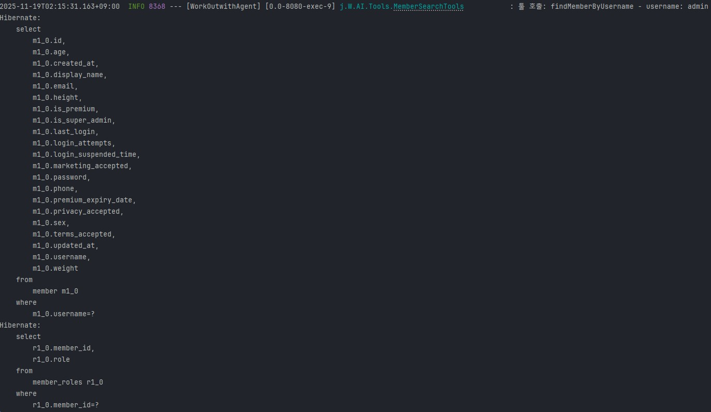
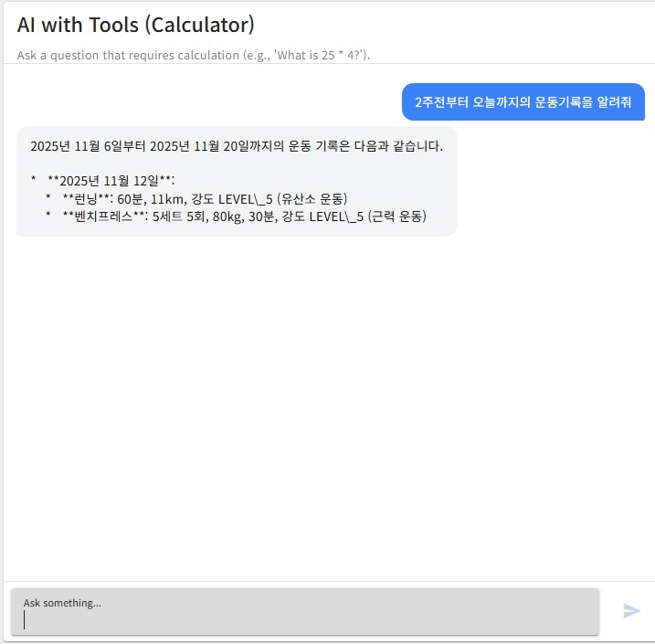
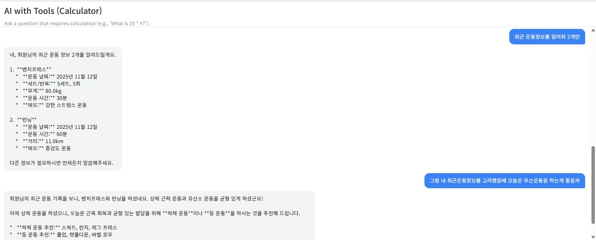
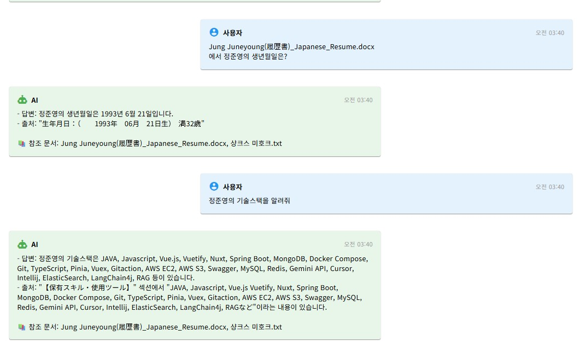
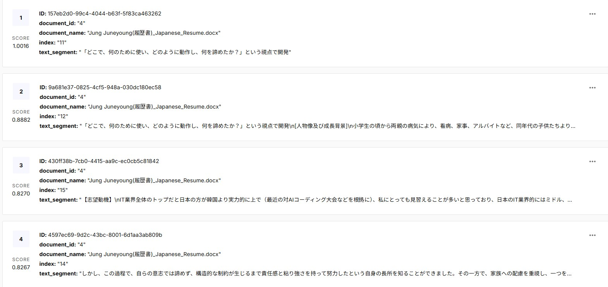

# 💪 WorkOutwithAgent

> AI 기반 피트니스 트래킹 애플리케이션 - LangChain4j와 Google Gemini를 활용한 지능형 운동 관리 시스템

[](https://spring.io/projects/spring-boot)
[](https://www.oracle.com/java/)
[](https://github.com/langchain4j/langchain4j)

## 📋 프로젝트 소개

WorkOutwithAgent는 **AI 어시스턴트가 직접 코드를 실행**하여 사용자의 실제 운동 기록과 식단 정보를 조회하고 분석하는 LangChain4j 기반의 애플리케이션입니다.

### ✨ 주요 특징

- 🤖 **AI Tools 기반 자동 실행**: LangChain4j의 Tool 기능을 활용하여 AI가 필요한 정보를 직접 조회
- 💬 **자연어 질의응답**: "2주전부터 오늘까지의 운동기록을 알려줘" 같은 자연어 질문으로 데이터 조회
- 🧠 **RAG 지원**: 문서 기반 질의응답을 위한 Retrieval Augmented Generation 구현
- 💾 **Redis 기반 채팅 메모리**: 대화 컨텍스트를 Redis에 저장하여 세션 관리


## 🎯 핵심 기능

### 1. AI Tools를 통한 자동 코드 실행

AI가 사용자의 질문을 분석하고, 필요한 경우 자동으로 제공된 Tools를 호출하여 데이터를 조회합니다.

**예시:**

```
사용자: "2주전부터 오늘까지의 운동기록을 알려줘"

AI 처리 과정:
1. 질문 분석 → 날짜 범위 계산 (2주 전 ~ 오늘)
2. WorkoutAndMealTools.findWorkoutsByUsername() 자동 호출
3. 데이터베이스에서 운동 기록 조회
4. 조회된 데이터를 기반으로 자연어 응답 생성
```



### 2. 자연어 기반 운동 기록 조회 및 운동 추천

1. 복잡한 API 호출 없이 자연스러운 대화로 운동 기록을 확인할 수 있습니다.



2. 최근 운동을 고려하여 AI가 오늘의 운동을 추천해줍니다. 



### 3. RAG (Retrieval Augmented Generation), VectorDB 예시

문서를 벡터화하여 저장하고, 유사도 검색을 통해 정확한 답변을 생성합니다.




## 🛠 기술 스택

### Backend

- **Framework**: Spring Boot 3.5.7
- **Language**: Java 21
- **AI/ML**:
  - LangChain4j 1.0.0-alpha1
  - Google Gemini API (gemini-2.5-flash, gemini-2.5-pro)
- **Database**:
  - MySQL (주 데이터베이스)
  - Redis (채팅 메모리 및 세션 관리)
- **Security**: Spring Security + JWT
- **Documentation**: SpringDoc OpenAPI (Swagger)

### 주요 라이브러리

- `dev.langchain4j:langchain4j-core`
- `dev.langchain4j:langchain4j-google-ai-gemini`
- `dev.langchain4j:langchain4j-spring-boot-starter`
- `io.jsonwebtoken:jjwt` (JWT 토큰 처리)

## 📁 프로젝트 구조

```
WorkOutwithAgent/
├── AI/
│   ├── AssistantModels/      # AI 어시스턴트 인터페이스
│   │   ├── Assistant.java    # Tools 기반 어시스턴트
│   │   ├── StreamingAssistant.java  # 스트리밍 응답 어시스턴트
│   │   └── RagAssistant.java        # RAG 전용 어시스턴트
│   ├── Tools/                # AI가 사용할 수 있는 도구들
│   │   ├── MemberSearchTools.java      # 회원 검색 도구
│   │   ├── WorkoutAndMealTools.java    # 운동/식단 조회 도구
│   │   └── UtilTools.java              # 유틸리티 도구
│   └── Controller/
│       └── AIController.java  # AI 채팅 API
├── Config/
│   └── LangChainConfig.java   # LangChain4j 설정
├── Workout/                   # 운동 기록 모듈
├── Meal/                      # 식단 기록 모듈
├── Member/                     # 회원 관리 모듈
└── Redis/                      # Redis 채팅 메모리 저장소
```

## 🚀 시작하기

### 사전 요구사항

- Java 21 이상
- MySQL 8.0 이상
- Redis 6.0 이상
- Google Gemini API Key

### 설치 및 실행

1. **저장소 클론**

```bash
git clone https://github.com/your-username/WorkOutwithAgent.git
cd WorkOutwithAgent
```

2. **환경 변수 설정**

```properties
# application.properties 또는 환경 변수
google.gemini.api.key=your-gemini-api-key
spring.datasource.url=jdbc:mysql://localhost:3306/workout_db
spring.datasource.username=your-username
spring.datasource.password=your-password
spring.data.redis.host=localhost
spring.data.redis.port=6379
```

3. **애플리케이션 실행**

```bash
./gradlew bootRun
```

4. **API 문서 확인**

- Swagger UI: http://localhost:8080/swagger-ui.html

## 💡 사용 예시

### AI 채팅 API

```http
POST /api/v1/ai/chat
Content-Type: application/json
Authorization: Bearer {jwt-token}

{
  "message": "2주전부터 오늘까지의 운동기록을 알려줘"
}
```

**응답:**

```json
{
  "response": "2025년 11월 6일부터 2025년 11월 20일까지의 운동 기록은 다음과 같습니다.\n\n**2025년 11월 12일:**\n- **런닝**: 60분, 11km, 강도 LEVEL_5 (유산소 운동)\n- **벤치프레스**: 5세트 5회, 80kg, 30분, 강도 LEVEL_5 (근력 운동)"
}
```

### AI Tools 동작 원리

1. **사용자 질문 입력**
2. **AI가 질문 분석 및 필요한 Tool 판단**
3. **자동으로 Tool 메서드 호출** (예: `findWorkoutsByUsername()`)
4. **데이터베이스에서 정보 조회**
5. **조회된 데이터를 기반으로 자연어 응답 생성**

## 🔧 주요 컴포넌트

### AI Tools

#### MemberSearchTools

- `findMemberByUsername()`: 사용자명으로 회원 정보 조회
- `findMemberByEmail()`: 이메일로 회원 정보 조회
- `findMemberById()`: ID로 회원 정보 조회

#### WorkoutAndMealTools

- `findWorkoutsByUsername()`: 날짜 범위 내 운동 기록 조회

### Redis Chat Memory

대화 컨텍스트를 Redis에 저장하여 세션별로 최근 20개 메시지를 유지합니다.

```java
MessageWindowChatMemory.builder()
    .id(userId)
    .maxMessages(20)
    .chatMemoryStore(redisStore)
    .build()
```

## 📝 개발 상태

⚠️ **현재 개발 중인 프로젝트입니다.**

- ✅ AI Tools 기반 자동 실행
- ✅ 자연어 질의응답
- ✅ RAG 기본 구조
- 🚧 추가 AI Tools 개발
- 🚧 프론트엔드 UI/UX 개선
- 🚧 고급 분석 기능


## 👤 작성자
정준영